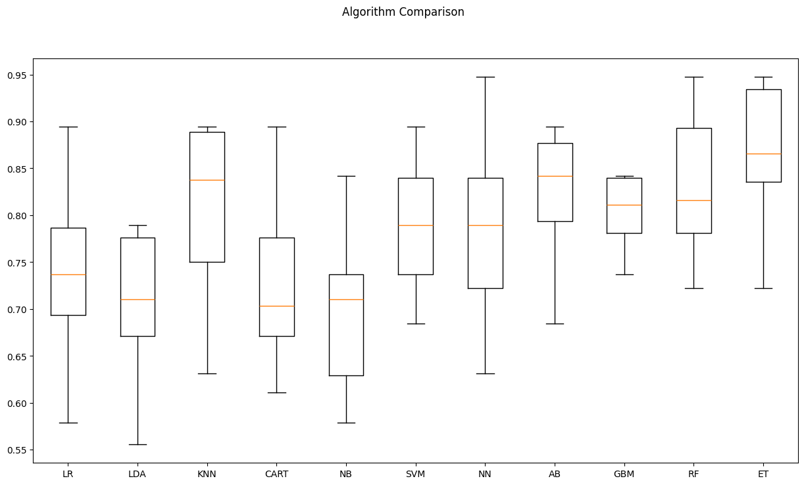

# Rock vs Mine Prediction

A machine learning project for classifying sonar signals as either **rock** or **mine**.

## 📌 About

The project uses the **Sonar dataset** to train and compare different classification algorithms for distinguishing between rocks and mines.

The models are evaluated using **10-fold cross-validation**, with accuracy used as the main metric.

## 🤖 Models

Several classification algorithms were compared, including:

* Logistic Regression
* Linear Discriminant Analysis
* KNN
* Decision Tree
* Naive Bayes
* SVM
* Neural Network
* AdaBoost
* Gradient Boosting
* Random Forest
* Extra Trees

**Extra Trees** performed best during the model comparison and was selected for further tuning.

## 📊 Results

The final model was an **Extra Trees Classifier**, which was trained with tuned parameters and evaluated on the test set.

<p align="center">
  
</p>

## 🛠️ Built With

* Python
* Pandas
* NumPy
* Scikit-learn
* Matplotlib
* Seaborn

## 💾 Model

The final trained model is saved using **Pickle** as:

```text
finalized_model.sav
```

## 📂 Project Structure

```text
rock-vs-mine-prediction/
│
├── images/
├── Rock_vs_mine_predicton.ipynb
├── finalized_model.sav
├── README.md
```
